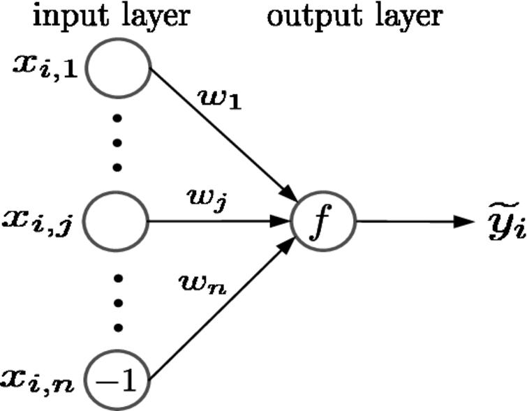
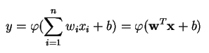
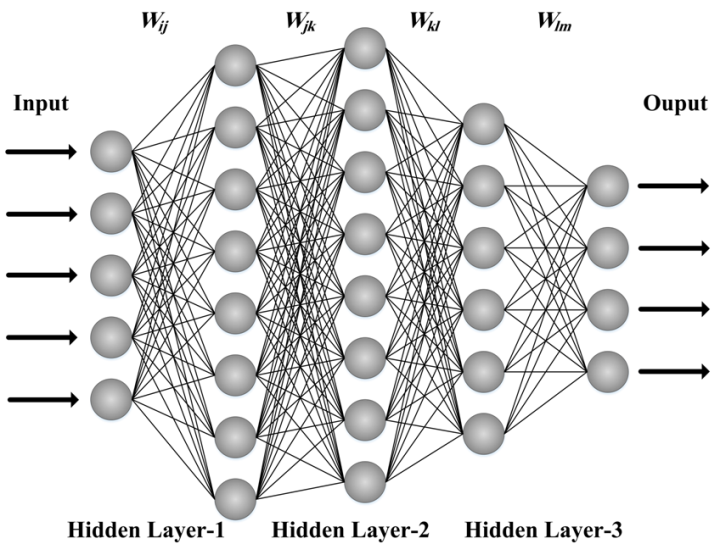
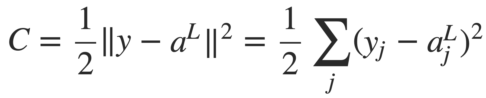
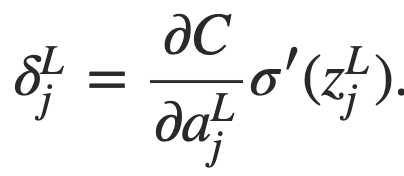

# Math 270 Honors Project
**Authored by Malcolm McSwain**

The demo for this project is hosted at http://math-270-honors-project.appspot.com/

The goal of this project is to provide a relatively simple but comprehensive understanding of the mathematics, with a foundation in linear algebra and multivariable calculus, and computation, handled by the TensorFlow Layers API, required for designing, compiling, training, and testing neural networks.

## Conceptual Framework

Neural networks are essentially complex mathematical "objects", loosely based on the biological design of our own brains, that can be thought of as a multi-layered function. In the **perceptron**, the quintessential feedforward neural network, individual nodes, or **neurons**, have a numerical state. Subsequent nodes are interconnected by weighted vertices.

 
*Source: https://content.iospress.com/articles/journal-of-high-speed-networks/jhs594*

The next node in a series is defined by a weighted sum of the previous set of nodes (defined by a vector **x**) combined with the associated weights, (defined by a vector **w**) plus some additional bias **b**. This sum is then fed through an **activation function**. The purpose of this function is to normalize or "squeeze" a wide range of values produced as the output of a previous layer into some predictable range. A common example is the *sigmoid function*.

 
*Source: https://skymind.ai/wiki/multilayer-perceptron*

In a **multilayer perceptron**, a set of nodes that are individually "linked" to every member of a previous set of nodes can be defined as a dense, or fully connected, **hidden layer**. In this sense, each layer represents a linear transformation applied to the previous layer. However, the use of an activation function such as sigmoid or tanh, when applied to the transformation, will allow for *nonlinear* classification.

 
*Source: http://pubs.sciepub.com/ajmm/3/3/1/figure/5*

Many other forms of neural network machine learning models exist, such as the *convolutional neural network*, but we will use the design of the multilayer perceptron as our foundation for understanding the compilation and training of machine learning models.

## Supervised Learning via Backpropagation

The real power and utility of a neural network comes from its training algorithm, which, if successful, will adjust the weights and biases of the model so that it will produce a desired output. This requires:
- A set of training data with inputs and expected outputs
- A rigorously defined cost or loss function, C, that can calculate the error between the expected output and the actual output
- A methodology for the calculation of the **gradient** of C, denoted by ∇C = δ, which represents the direction of greatest increase for the cost function

We begin with the definition of the *quadratic cost function*, given by:

 
*Source: http://neuralnetworksanddeeplearning.com/chap2.html*

y(x) represents the expected output for a given input x, a^L(x) is the vector of output from the activation functions of a layer L, which is summed over j training examples.

Ultimately, what we need to find is *how the cost function responds to changes in the weights and biases*, or ∂C/∂w and ∂C/∂b.

We begin by defining δ^L_j as the error of an individual node j in layer L. Then:

 

Breaking this equation down, we compute the partial derivative of the cost function with respect to the activation of a node j in layer L and multiply it with the derivative of the sigmoid activation function applied to z, which represents the neuron input, or the weighted sum of the previous layer. (think z = wx + b)

Rewriting in matrix form, we get:
