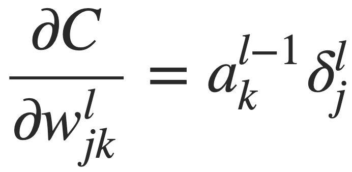

# Math 270 Honors Project
**Authored by Malcolm McSwain**

The demo for this project is hosted at https://math-270-honors-project.malcolmmcswain.now.sh/

The goal of this project is to provide a relatively simple but comprehensive understanding of the mathematics, with a foundation in linear algebra and multivariable calculus, and computation, handled by the TensorFlow Layers API, required for designing, compiling, training, and testing neural networks.

## Conceptual Framework

Neural networks are essentially complex mathematical "objects", loosely based on the biological design of our own brains, that can be thought of as a multi-layered function. In the **perceptron**, the quintessential feedforward neural network, individual nodes, or **neurons**, have a numerical state. Subsequent nodes are interconnected by weighted vertices.

<br />
*Source: https://content.iospress.com/articles/journal-of-high-speed-networks/jhs594*

The next node in a series is defined by a weighted sum of the previous set of nodes (defined by a vector **x**) combined with the associated weights, (defined by a vector **w**) plus some additional bias **b**. This sum is then fed through an **activation function**. The purpose of this function is to normalize or "squeeze" a wide range of values produced as the output of a previous layer into some predictable range. A common example is the *sigmoid function*.

<br />
*Source: https://skymind.ai/wiki/multilayer-perceptron*

In a **multilayer perceptron**, a set of nodes that are individually "linked" to every member of a previous set of nodes can be defined as a dense, or fully connected, **hidden layer**. In this sense, each layer represents a linear transformation applied to the previous layer. However, the use of an activation function such as sigmoid or tanh, when applied to the transformation, will allow for *nonlinear* classification.

<br />
*Source: http://pubs.sciepub.com/ajmm/3/3/1/figure/5*

Many other forms of neural network machine learning models exist, such as the *convolutional neural network*, but we will use the design of the multilayer perceptron as our foundation for understanding the compilation and training of machine learning models.

## Supervised Learning via Backpropagation

The real power and utility of a neural network comes from its training algorithm, which, if successful, will adjust the weights and biases of the model so that it will produce a desired output. This requires:
- A set of training data with inputs and expected outputs
- A rigorously defined cost or loss function, C, that can calculate the error between the expected output and the actual output
- A methodology for the calculation of the **gradient** of C, denoted by ∇C = δ, which represents the direction of greatest increase for the cost function

We begin with the definition of the *quadratic cost function*, given by:

<br />
*Source: http://neuralnetworksanddeeplearning.com/chap2.html*

y(x) represents the expected output for a given input x, a^L(x) is the vector of output from the activation functions of a layer L, which is summed over j training examples.

Ultimately, what we need to find is *how the cost function responds to changes in the weights and biases*, or ∂C/∂w and ∂C/∂b.

We begin by defining δ^L_j as the error of an individual node j in layer L. Then:

<br />

Breaking this equation down, we compute the partial derivative of the cost function with respect to the activation (∂C/∂a) of a node j in layer L and multiply it with the derivative of the sigmoid activation function applied to z, which represents the neuron input, or the weighted sum of the previous layer. (think z = wx + b)

Rewriting in matrix form, we get:

<br />

This is the *Hadamard product* (⊙ = elementwise multiplication) of ∇\_aC, the vector of ∂C/∂a's for each neuron in the layer, and the vector of differentiated activations applied to the layer inputs.

For each consecutive layer, moving *backwards*, we have the error for l defined recursively in terms of the next layer (l + 1) as:

<br />

which replaces the the vector of ∂C/∂a's for each neuron in the layer with the transpose of the weights vector of the next layer multiplied by the error of that layer.

This is important for our algorithm because, through this definition, we can calculate the error recursively, propagating backwards through the neural network, giving rise to the name **backpropagation**.

Once we have the error, we can calculate the gradients for the biases and weights respectively with:

, <br />

Finally, we adjust the weights and biases by subtracting the normalized gradients. This loss optimization technique is called **stochastic gradient descent**. Conceptually, the gradient vector points in the direction of greatest increase of a function. Thus, we step in the *opposite* direction, and re-calculate the gradient here, stepping backwards again, repeating this process until it flattens out, signifying we have optimized C.

In practice, large datasets containing a set of inputs and corresponding expected outputs are split up into **batches** and fed through the algorithm one batch at a time. Once all batches have passed through, the process is repeated for a desired number of **epochs**.

After the training is complete, new values can be tested by feeding them into the model and observing the output produced by the new weights and biases.

Read more on backpropagation and stochastic gradient descent: http://neuralnetworksanddeeplearning.com/chap2.html

## Implementation using TensorFlow.js

For this project, I wanted to build an application that would allow users to experiment with different neural network structures and see how it affects the compilation, optimization, shape, and performance of their model.

### Tech stack

I decided to use **TensorFlow.js**, a high-level API (initially created by Google) that takes care of all the low-level computation involved with machine learning. Additionally, TensorFlow.js will run in the browser efficiently thanks to the WebGL-enabled use of the GPU, a computational engine designed for handling large matrices and vectors. (typically in the use case of rendering graphics) This would also allow me to provide an interactive user interface written in **React**. (a robust framework for delivering user interfaces in JavaScript by Facebook) Finally, I used **Next.js** (deployed via ZEIT Now) to bootstrap and build Node, TensorFlow, and React on the backend.

### What is a tensor?

To understand TensorFlow, you must first understand a tensor as an abstract mathematical object. Simply put, a tensor is just a generalization of scalars and vectors.

A tensor can be a number: `1` (rank 0, shape 0)

...or a vector: `[1,2,3]` (rank 1, shape 3)

...or a vector of vectors: `[[1,2,3],[4,5,6],[7,8,9]]` (rank 2, shape (3,3))

... or a vector of vectors of vectors:

`[[[1,2],[3,4]],[[5,6],[7,8]]]` (rank 3, shape  (2,2,2))

...and so on.

Tensors are the fundamental mutable objects handled by the TensorFlow API, and must be used to feed through models. They are defined by their shape.

### Getting the data

For this example, I used this sample data provided by Google: https://storage.googleapis.com/tfjs-tutorials/carsData.json

```js
async getData() {
  const carsDataReq = await fetch('https://storage.googleapis.com/tfjs-tutorials/carsData.json');
  const carsData = await carsDataReq.json();
  const cleaned = carsData.map(car => ({
    mpg: car.Miles_per_Gallon,
    horsepower: car.Horsepower,
  })).filter(car => (car.mpg != null && car.horsepower != null));

  return cleaned;
}
```

This asynchronuous function requests the data via fetch(), an API for making HTTP GET requests, converts it to JSON, or JavaScript Object Notation, and gets rid of all the extraneous data.

### Converting to tensors

Next, we need to shuffle and normalize the data, then put the inputs (or xs) and labels (or ys) into tensors.

```js
convertToTensor(data) {
  return tf.tidy(() => {
    tf.util.shuffle(data);

    const inputs = data.map(d => d.horsepower);
    const labels = data.map(d => d.mpg);

    const inputTensor = tf.tensor2d(inputs, [inputs.length, 1]);
    const labelTensor = tf.tensor2d(labels, [labels.length, 1]);

    const inputMax = inputTensor.max();
    const inputMin = inputTensor.min();
    const labelMax = labelTensor.max();
    const labelMin = labelTensor.min();

    const normalizedInputs = inputTensor.sub(inputMin).div(inputMax.sub(inputMin));
    const normalizedLabels = labelTensor.sub(labelMin).div(labelMax.sub(labelMin));

    return {
      inputs: normalizedInputs,
      labels: normalizedLabels,
      inputMax,
      inputMin,
      labelMax,
      labelMin,
    }
  })
}
```

This function uses minmax normalization to transform the dataset
 (`inputTensor.sub(inputMin).div(inputMax.sub(inputMin))`)
 then returns the prepared tensors.

### Training the model

 ```js
 async trainModel(model, inputs, labels) {
   model.compile({
     optimizer: tf.train.adam(),
     loss: tf.losses.meanSquaredError,
     metrics: ['mse'],
   });

   const batchSize = parseInt(this.state.batchSize);
   const epochs = parseInt(this.state.epochs);

   return await model.fit(inputs, labels, {
     batchSize,
     epochs,
     shuffle: true,
     callbacks: tfvis.show.fitCallbacks(
       { name: 'Training Performance' },
       ['loss', 'mse'],
       {
         height: 200,
         callbacks: ['onEpochEnd']
       }
     )
   });
 }
 ```

 Here, we compile a given model, defining an optimizer, (adam is an algorithm for first-order gradient descent optimization) loss, (mean squared error) and metrics. The batch size and number of epochs are connected to the UI. Finally, the model.fit() method is called to train the model according to all the defined parameters and render it using `tfvis`. (a library for visualization of machine learning operations)

 ### Testing the model
```js
 testModel(model, inputData, normalizationData) {
   const {inputMax, inputMin, labelMin, labelMax} = normalizationData;

   const [xs, preds] = tf.tidy(() => {
     const xs = tf.linspace(0, 1, 100);
     const preds = model.predict(xs.reshape([100, 1]));

     const unNormXs = xs.mul(inputMax.sub(inputMin)).add(inputMin);
     const unNormPreds = preds.mul(labelMax.sub(labelMin)).add(labelMin);

     return [unNormXs.dataSync(), unNormPreds.dataSync()];
   });

   const predictedPoints = Array.from(xs).map((val, i) => {
     return {x: val, y: preds[i]}
   });

   const originalPoints = inputData.map(d => ({
     x: d.horsepower,
     y: d.mpg,
   }));

   tfvis.render.scatterplot(
     {name: 'Model Predictions vs Original Data'},
     {values: [originalPoints, predictedPoints], series: ['original', 'predicted']},
     {
       xLabel: 'Horsepower',
       yLabel: 'MPG',
       height: 300
     }
   );
 }
 ```

Finally, we generate a linearly defined array of numbers and feed them into the model and use the tfvis scatterplot to see the results of our training.

You can read all the primary source code for the demo [here](https://github.com/malcolmmcswain/ml-models/blob/master/pages/index.js).
